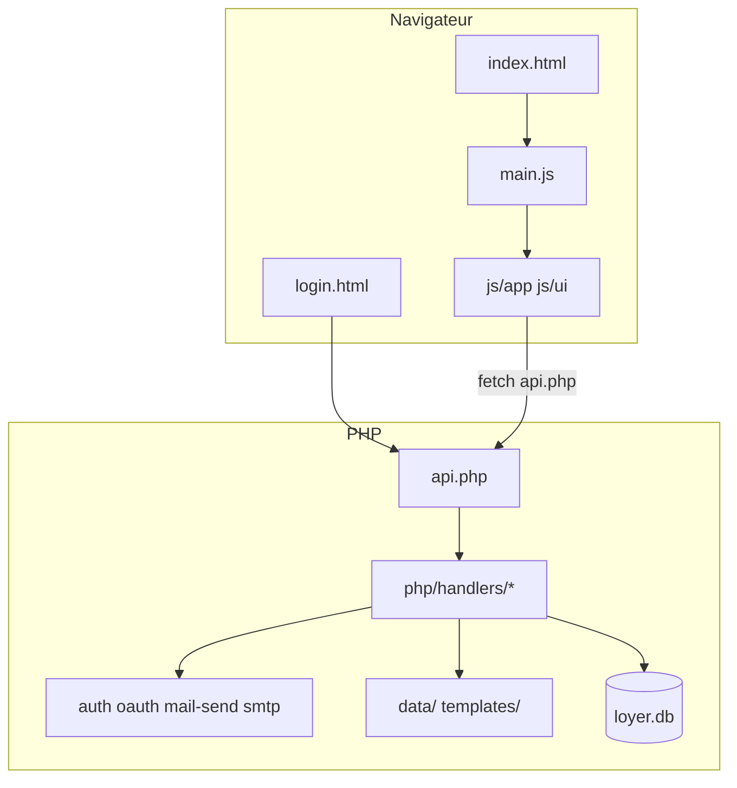

# Architecture Loyer Manager

Document de référence — structure du projet, responsabilités des modules.

## Vue d'ensemble

Application **vanilla** sans build : HTML + JS côté client, PHP côté serveur.

## Backend PHP

### Point d'entrée

[`api.php`](../api.php) — routeur `?action=` → handler (~60 lignes).

### Couches

| Couche | Fichiers | Responsabilité |
|--------|----------|----------------|
| Bootstrap | `php/bootstrap.php` | Config, chemins, chargements |
| HTTP | `php/http.php` | JSON, auth session/API |
| Auth | `php/auth.php`, `handlers/auth-api.php` | Compte, session, OAuth identité |
| Domaine fichiers | `php/templates-fs.php` | Modèles sur disque |
| Domaine métier | `oauth.php`, `mail-send.php`, `smtp.php`, `activity-log.php` | Mail, journal |
| Infra | `db.php`, `crypto.php`, `app.php` | SQLite, chiffrement |
| Handlers | `php/handlers/` | Une action = une fonction |

### Actions API principales

| Domaine | Actions |
|---------|---------|
| Système | `config`, `status`, `app-settings` |
| Auth | `auth-status`, `auth-setup`, `auth-login`, `auth-logout`, `auth-change-password`, `auth-oauth-start`, `auth-delete-account` |
| Données | `data`, `templates`, `template` |
| Mail OAuth | `oauth-status`, `oauth-start`, `oauth-callback`, `oauth-disconnect`, `oauth-set-active` |
| Mail envoi | `send-mail`, `save-mail-draft`, `smtp-settings`, `mail-transport-status` |
| Historique | `activity-log`, `log-export`, `log-csv-import` |

### Persistance

| Donnée | Support |
|--------|---------|
| Loyers, virements, paramètres | `data/loyer-data.json` |
| Modèles | `templates/quittances/`, `templates/mails/` |
| Compte, OAuth mail, SMTP, historique | `data/loyer.db` |
| Secrets | `config.php` |

Les loyers **ne migrent pas** vers SQLite — export/import JSON inchangé.

## Frontend JavaScript

### Structure (phase 2)

| Zone | Fichiers | Rôle |
|------|----------|------|
| Entrée | `main.js`, `auth.js` | Init, gate login |
| App | `js/app/core.js`, `period.js`, `shell.js` | État `LoyerApp`, période, navigation |
| UI | `js/ui/*.js` | Dashboard, virements, paramètres, modèles, quittance, mail |
| Domaine | `store.js`, `calculations.js`, `mail.js`, `quittance.js`… | Métier pur |
| v1.0+ | `mail-oauth.js`, `activity-log.js`, `consent.js`, `help.js` | OAuth mail, historique, aide |

Namespace partagé : `global.LoyerApp`.

### Ordre des scripts (`index.html`)

1. Utilitaires, `calculations.js`
2. **`server-api.js` avant `store.js`**
3. Domaine (templates, quittance, export, mail)
4. `mail-oauth.js`, `activity-log.js`, `consent.js`, `auth.js`, `help.js`
5. **`js/app/*` → `js/ui/*` → `shell.js` → `main.js`**

## Contraintes

- **Pas de build** (Webpack, Vite)
- **Pas de migration JSON → SQLite** pour les loyers
- **Ne pas modifier `lib/`** (Quill, html2pdf, Chart.js)

## Évolutions ouvertes

| Besoin | Piste |
|--------|-------|
| Mode démo sans connexion | Flag ou `demo.html` + JSON statique |
| Doc GitHub complète | `docs/` |

## Historique

- **v1.0 phase 2** — Découpage `js/app/` + `js/ui/`, `main.js` ~110 lignes
- **v1.0** — OAuth mail, SQLite, handlers modulaires, auth session, brouillons mail, SMTP
